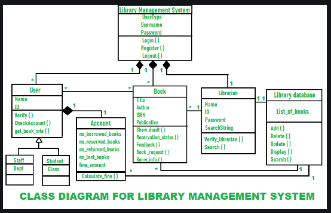

# MATA62-trabalho-final: Sistema de Biblioteca

## 1. Objetivo

Este trabalho tem como objetivo a aplicação prática dos conhecimentos em projeto e programação orientados a objetos, através do desenvolvimento parcial de um sistema de gerenciamento de biblioteca.

## 2. Visão Geral do Sistema

O sistema proposto visa gerenciar e manter os livros disponíveis em uma biblioteca acadêmica, atendendo às necessidades de três tipos de usuários: alunos de graduação, alunos de pós-graduação e professores.

As principais funcionalidades incluem:

* **Cadastro:** de livros e usuários.
* **Empréstimo:** com regras específicas para cada tipo de usuário e registro da data de devolução.
* **Devolução:** de livros emprestados.
* **Reserva:** de livros, com prioridade para alunos.

### 2.1. Livros
Cada livro possui um código de identificação único, título e informações adicionais como editora, autores, edição e ano de publicação.

### 2.2. Usuários
Os usuários são classificados em três categorias: alunos de graduação, alunos de pós-graduação e professores. Cada categoria possui um período de empréstimo específico, conforme a Tabela 1.

| Tipo de Usuário | Tempo de Empréstimo (dias) |
|---|---|
| Aluno de Graduação | 4 |
| Aluno de Pós-Graduação | 5 |
| Professor | 8 |
| Tabela 1: Tempo de Empréstimo por Tipo de Usuário |

## 3. Funcionalidades

### 3.1. Empréstimo

A funcionalidade principal do sistema é permitir o empréstimo de livros.

#### 3.1.1. Processo de Empréstimo
Para realizar um empréstimo, o usuário deverá informar o comando "emp" seguido pelo código do usuário e pelo código do livro, separados por um espaço. Ex: "emp 123 100". Caso o usuário tenha feito uma reserva para o livro em questão, a mesma deve ser cancelada e o empréstimo será efetivado. Ao final do processo, o sistema deve emitir uma mensagem de sucesso ou insucesso, mencionando o nome do usuário e o título do livro. Em caso de insucesso, a mensagem também informará o motivo.

#### 3.1.2. Regras de Empréstimo para Alunos
O empréstimo de um livro será realizado para um aluno de graduação ou de pós-graduação apenas se:

1. Houver exemplares disponíveis na biblioteca;
2. O usuário não estiver "devedor" com livros em atraso;
3. O usuário seguir as regras específicas referentes à quantidade máxima de livros que podem ser emprestados (conforme Tabela 2);
4. A quantidade de reservas existentes do livro deve ser menor do que a quantidade de exemplares disponíveis, desde que o usuário não tenha uma reserva para esse livro;
5. Se a quantidade de reservas for igual ou superior à de exemplares disponíveis, o empréstimo será permitido apenas se uma das reservas for do usuário;
6. O usuário não pode ter nenhum empréstimo em andamento de um exemplar desse mesmo livro.

| Tipo de Usuário | Limite de Empréstimos em Aberto |
|---|---|
| Aluno de Graduação | 2 livros |
| Aluno de Pós-Graduação | 3 livros |
| Tabela 2. Limites da quantidade de livros para empréstimo |

#### 3.1.3. Regras de Empréstimo para Professores
O empréstimo do livro só será concretizado para um professor se:
1. Houver a disponibilidade de algum exemplar daquele livro na biblioteca; e
2. O usuário não estiver como "devedor" de um livro em atraso.

Observe que os professores não terão o empréstimo negado, mesmo que haja reservas para o livro em questão, e não há limite para a quantidade de livros que eles podem pegar emprestado.
É sabido que nesse tipo de domínio essas regras estão sujeitas a frequentes mudanças. Além disso, podem surgir novos tipos de usuário para os quais as regras de empréstimo sejam diferentes das já existentes para professor e alunos de graduação e de pós. Abaixo serão listadas outras funcionalidades que o sistema deve ter. Leia com atenção.

### 3.2. Devolução de Livros
O sistema permite a devolução de livros através do comando:
res <código_usuário> <código_livro>
O sistema verifica se o usuário já atingiu o limite máximo de reservas (3) e se o livro está disponível para reserva. Caso positivo, registra a reserva com a data atual.

**Mensagem de retorno:**
* **Sucesso:** Confirma a realização da reserva.
* **Insucesso:** Informa o motivo do insucesso (limite de reservas atingido ou livro indisponível).

### 3.4. Registro de Observação de Livros
Professores podem se registrar como observadores de livros para receber notificações quando um livro atingir um determinado número de reservas. O comando para registro é:
obs <código_usuário> <código_livro>

### 3.5. Consulta de Informações de Livro
Para obter informações sobre um livro específico, utilize o comando:
liv <código_livro>
O sistema retornará informações como título, quantidade de reservas, usuários que realizaram reservas, status dos exemplares e detalhes de empréstimos.

### 3.6. Consulta de Informações de Usuário
Para consultar o histórico de um usuário, utilize o comando:
usu <código_usuário>
O sistema apresentará a lista de empréstimos (correntes e passados), incluindo informações sobre o livro, data do empréstimo, status e data de devolução. Também será exibida a lista de reservas realizadas pelo usuário.

#### 3.7. Consulta de Notificações
Para consultar o número de notificações recebidas, use:
ntf <código_usuário>

### 3.8. Sair do Sistema
Para sair do sistema, digite:
sai

### 4. Exigências do Projeto
* **Persistência:** Os dados serão mantidos em memória durante a execução.
* **Singleton:** Uma classe Singleton gerenciará usuários e livros.
* **Restrições de Cadastro:** Não há cadastro de novos itens.
* **Interface:** Interface de linha de comando.
* **Processamento de Comandos:** Uma classe específica para processar comandos.
* **Padrão Command:** Será utilizado para desacoplar a invocação de comandos.
* **Seleção de Regras:** Um padrão de projeto será usado para selecionar regras de empréstimo.

### Sugestão de Diagrama de Classes Simplificado

Obs.: ainda precisamos adequar o diagrama aos Padrões de projeto.